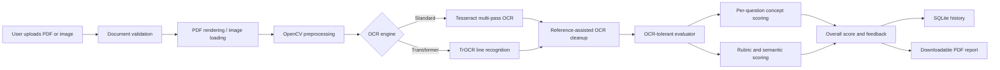
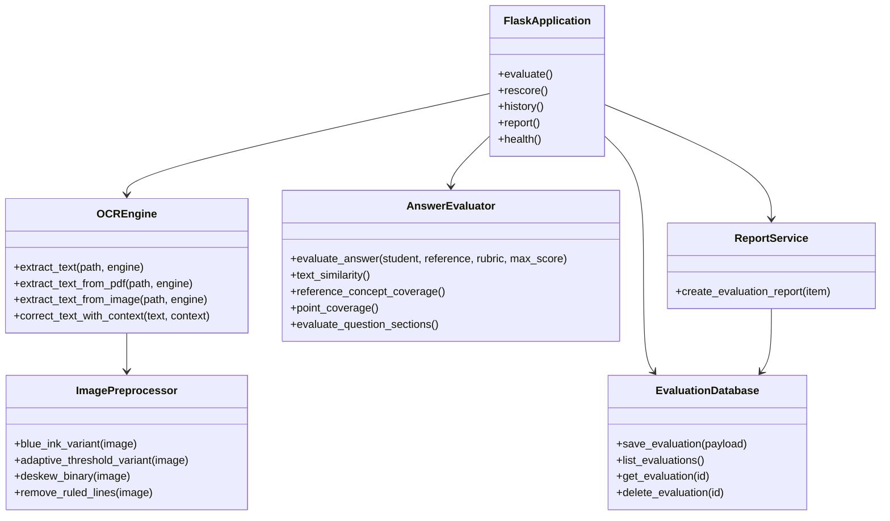
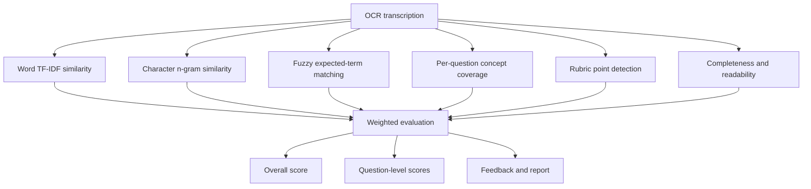

# AI Answer Sheet Evaluator

A local-first web application that evaluates handwritten, scanned, or digital answer sheets against teacher-provided expected answers and marking points. It accepts arbitrary PDF and image uploads, performs OCR, applies OCR-tolerant semantic and concept evaluation, calculates per-question and overall scores, stores local history, and generates downloadable PDF reports.

## Why This Project Exists

Traditional OCR-based grading often marks correct answers as incorrect because handwriting recognition produces spelling and character errors. This project separates **transcription quality** from **answer quality**. The evaluator combines OCR preprocessing, fuzzy concept matching, character-level similarity, semantic similarity, rubric coverage, and answer completeness so that readable concepts can still receive credit even when OCR text is imperfect.

## Core Capabilities

- Upload arbitrary `PDF`, `JPG`, `PNG`, `WEBP`, or `TIFF` answer sheets.
- Enter any questions, expected answers, marking points, and maximum score.
- Process multi-page scanned PDFs and digital PDFs.
- Choose standard offline OCR or optional transformer handwriting OCR.
- Evaluate numbered multi-question answers with per-question scores.
- Apply OCR-tolerant concept, keyword, semantic, completeness, and rubric scoring.
- Review matched and missing marking points.
- Keep raw OCR outside the main interface in an optional technical-review section.
- Save evaluation history locally using SQLite.
- Download polished PDF evaluation reports.
- Run fully locally without uploading answer sheets to an external service.

## System Workflow



## Component UML



## Scoring Architecture



The evaluator does not require the student to use the exact reference wording. It searches for expected concepts and tolerates OCR spelling errors using fuzzy token matching and character-level similarity.

## Technology Stack

| Layer | Technology | Purpose |
|---|---|---|
| Web backend | Python, Flask, Werkzeug | Upload handling, APIs, history, and report endpoints |
| Frontend | HTML, CSS, JavaScript | Interactive local evaluation dashboard |
| Standard OCR | Tesseract, pytesseract | Reliable offline document OCR |
| Advanced OCR | Microsoft TrOCR, PyTorch, Transformers | Optional handwritten single-line transformer recognition |
| Image processing | OpenCV, Pillow, NumPy | Upscaling, ink isolation, denoising, thresholding, deskewing |
| PDF processing | PyMuPDF | PDF page rendering and digital-text extraction |
| NLP evaluation | scikit-learn | TF-IDF, word and character n-gram similarity |
| Fuzzy evaluation | Python `difflib` | OCR-tolerant expected-term matching |
| Data storage | SQLite | Local evaluation history |
| PDF reports | ReportLab | Downloadable evaluation reports |
| Testing | Python `unittest` | Scoring regression and endpoint verification |

## OCR Modes

### Standard OCR

The default mode uses OpenCV preprocessing and Tesseract. It is fully local, fast, and recommended for dependable demonstrations.

### Transformer OCR

The optional transformer mode uses `microsoft/trocr-base-handwritten`, a TrOCR model fine-tuned on the IAM handwritten-text dataset. TrOCR works on single text-line images, so the project segments document images into candidate lines before recognition. The model is downloaded on first use and requires significantly more memory and disk space.

No OCR model can guarantee perfect transcription for every handwriting style, scan angle, shadow, or page layout. The evaluator therefore remains tolerant of residual OCR errors.

## Project Structure

```text
.
├── app.py
├── config.py
├── database.py
├── demo_data.py
├── evaluator.py
├── ocr.py
├── report_service.py
├── requirements.txt
├── requirements-advanced.txt
├── run_mac.command
├── templates/
│   └── index.html
├── static/
│   ├── css/styles.css
│   └── js/app.js
├── tests/
│   └── test_evaluator.py
├── data/
└── uploads/
```

## macOS Setup

### Standard Local Installation

```bash
brew install tesseract
python3 -m venv .venv
source .venv/bin/activate
python -m pip install --upgrade pip
pip install -r requirements.txt
python app.py
```

Open the single application URL:

```text
http://127.0.0.1:5000
```

You can also double-click `run_mac.command` after installation.

### Optional Transformer Installation

Use Python 3.12 for the optional transformer environment. PyTorch wheel availability depends on the Python version and Mac architecture.

```bash
python3.12 -m venv .venv-transformer
source .venv-transformer/bin/activate
pip install -r requirements-advanced.txt
python app.py
```

The TrOCR model downloads on the first transformer-mode evaluation. Use standard mode when an internet connection is unavailable.

## General Evaluation Input

For any subject or exam:

1. Upload the student's answer-sheet PDF or image.
2. Enter the student name and maximum score.
3. Paste the question or numbered questions.
4. Paste the expected answer or numbered expected answers.
5. Enter marking points, one per line.
6. Select an OCR engine and evaluate.
7. Review overall score, per-question results, concepts, rubric findings, and feedback.
8. Download the PDF report.

Numbered expected answers are automatically separated into per-question evaluation sections.

## API Endpoints

| Method | Endpoint | Purpose |
|---|---|---|
| `GET` | `/` | Main application |
| `POST` | `/api/evaluate` | OCR and evaluate an uploaded answer sheet |
| `POST` | `/api/rescore` | Re-evaluate supplied text |
| `GET` | `/api/history` | List saved evaluations |
| `DELETE` | `/api/history` | Clear evaluation history |
| `GET` | `/api/history/<id>` | Load evaluation detail |
| `DELETE` | `/api/history/<id>` | Delete one evaluation |
| `GET` | `/api/report/<id>` | Download PDF report |
| `GET` | `/api/health` | Check application and Tesseract status |

## Evaluation Formula

When expected answers and marking points are supplied, the overall score combines:

- OCR-tolerant semantic similarity
- expected concept coverage
- marking-point coverage
- answer completeness
- readability
- aggregated per-question results for numbered answers

Weights are implemented in `evaluator.py` and can be adjusted for a specific institution.

## Testing

```bash
source .venv/bin/activate
python -m unittest discover -v
```

The included regression test ensures that meaningful answers with noisy OCR still receive appropriate concept and rubric credit.

## Limitations and Responsible Use

- Handwriting recognition quality varies by writer, image quality, lighting, scan angle, and page layout.
- Scores should support teacher review, not replace final academic judgment.
- Reference answers and marking points strongly affect evaluation quality.
- Transformer OCR requires a large model download and additional computation.
- All uploaded files and history remain on the local computer unless the user manually shares them.

## Research and Technical Basis

- [Tesseract output-quality guidance](https://tesseract-ocr.github.io/tessdoc/ImproveQuality.html)
- [OpenCV adaptive thresholding documentation](https://docs.opencv.org/4.x/d7/d4d/tutorial_py_thresholding.html)
- [TrOCR research paper](https://arxiv.org/abs/2109.10282)
- [Microsoft TrOCR handwritten model](https://huggingface.co/microsoft/trocr-base-handwritten)
- [ReportLab documentation](https://docs.reportlab.com/)

## License

This project is available under the MIT License.
